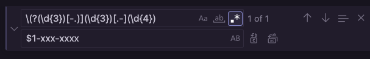
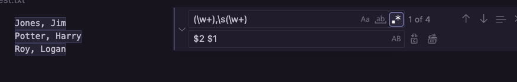
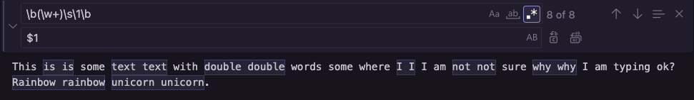

# Regex Tutorial: Finding Email strings, Phone strings, and More

Regex (or Regular expression) is a language used to find (or match) patterns in text strings or code. It can be used, not only to match patterns, but also to replace and reference the patterns found. This can be useful when needing to make repetitve changes in large amounts of text or code.

## Summary
This gist walks through how to match emails, phone numbers and repeated words in a block of text using Regex. 

Below are 4 Regex expressions we'll be able to express by the end of this tutorial: 
`\(?\d{3}[-.)]\d{3}[-.]\d{4}` (To express a phone number)  
`[\w.]+@\w+\.([a-z]{3}|[a-z]{2})` (To express an email address) 
`\b[A-Z][a-z]*\b` (To express capitalized words) 
`\b(\w+)\s\1\b` (To express double words and remove the repeated word)

## Table of Contents

- [Meta Characters](#meta-characters---single-characters)
- [Quantifiers](#quantifiers)
- [Boundaries](#boundaries)
- [OR Operator](#or-operator)
- [Position](#position)
- [Bracket Expressions](#bracket-expressions)
- [Capturing/Grouping](#capturing-groups)
- [Back-references](#back-references)
- [Greedy and Lazy Match](#greedy-and-lazy-match)

## Regex Components

### Meta Characters - Single Characters
- `\d` Finds 0-9 (digits) 
- `\w` Finds grouped characters a through z, A through Z, and 0 through 9 (any word or number)
- `\W` Finds the opposite of `\w`, (any non-letter or num)
- `\s` Finds whitespace (tab or space)
- `\S` Finds the opposite of `\s`, (any non-whitespace)
- `.` Finds any character whatsoever
- `\.` Finds a literal dot.

### Quantifiers
- `+` Finds one instance or more of the previous character
- `*` Finds 0 or more the previous character

 Examples: 
- `\w+` Finds all grouped characters (all words in a string)
 -or- 
`\w+\d+` Finds all grouped characters (all words in a string) followed by one or more digits

- `{n}` Finds any number (n) of a character in a string

 Example: `\w{5}` Finds all '5-letter' words in a string

### Boundaries
- `\b` Looks for a boundary when placed at beginning or end
 Example, `\b\w{4}\b` Finds all 4-character words, with a boundary around the words.

 Example, `\b\w{4,6}\b` Finds all 4-character or 6-character words.

### Or Operator
- `?` Specifies that the preceding character may or may not be present

 Example: `colou?rs?` Finds the words 'color', 'colors', or 'colour'

### Alternation
- `( a | b )` "alternation" using parentheses. Finds the next 'a' or 'b' in a string 

Example: `( net | com )` Find 'net' OR 'com' in a string: 

### Position 
- `^` Finds the specified character at the beginning of a string
  Example: `^Ro` Finds words beginning with 'Ro'
 Example: `^\w+` Finds all the words at the beginning of a line

- `$` --> Finds the specified character located at the end of a string
 Example: `an$` Finds all the words ending with 'an'
 Example: `\w+$` Finds all the words at the end of a line 

 Example: `^\w+$` Finds words that are the only word in a line

### Bracket Expressions
Brackets are used to match the chars specified within the brackets 
- `[]`
Example:`[abw]` Finds an 'a', or a 'b', or a 'w' in a string 
Example:  `[-(.]` Finds a dash '-', or an open parenth '(', or a dot '.' 

- Inside a bracket, a `-` at the beginning sepcifies a literal dash. 
- But, you can also use `-` to find a spread of letter or numbers.
Example: `[a-z]` specifies letters a through z

- Inside a bracket, an `^` at the beginning sepcifies 'anything other than' the subsequent characters in the bracket 
Example:`[^0-5]` means any characters not 0 through 5 

### Regex to find capitalized words:
`\b[A-Z][a-z]*\b`  
Here, we express a boundary, followed by uppercase letters, followed by lowercase letters, followed by an end boundary.

### Regex to find a phone number:
`\(?\d{3}[-.)]\d{3}[-.]\d{4}` 
Here, we express a literal open parenth with optional operator `\(?`, followed by a groupd of 3 digits `\d{3}`, followed by the literal chars '-', '.', or ')' expressed within brackets `[-.)]`, followed by a groupd of 3 digits `\d{3}`, followed by the literal chars '-' or '.' expressed within brackets `[-.]`, followed by a group of four 4 digits `\d{4}`

### Capturing Groups
In our phone number example, the entire matched string is called 'Group 0'
`\(?\d{3}[-.)]\d{3}[.-]\d{4}`

 We can further capture sub-groups by using parentheses as such: 
`\(?(\d{3})[-.)](\d{3})[.-](\d{4})` --> this groups the area code `(\d{3})`, the next three numbers `(\d{3})` and the last four numbers `(\d{4})`into Groups 0, 1 and 2

How to refer to those groups:
`$1` refers to Group 1 when used to replace something else with Group 1 
Example: To replace the last 7 digits of a phone number with 'xxx-xxxx': 
  

Let' say you have a list of names in the format 'Last, First' and you want to change to 'First Last'. 
This finds 'Last, First' names: 
`\w+,\s\w+`

Capture the last name and first name into Groups 0 and 1: 
`(\w+),\s(\w+)`

then re-order the groups you've captured
  

### Back-references
- `\1` refers to Group 1 used within the regex expression (see back-references).
- `\b(\w+)\s\1\b`
This regex captures the word, then includes \1 as a reference to that word. To be replaced with just the word using $ group reference

  

### Greedy and Lazy Match
.* is a greedy modifier
for example, this captures everything between brackets (does not separate google and test but everything between)
`\[.*\]`
[Google](www.google.com) [test]

You can use the ? to no longer make .* greedy but Lazy: 
`\[.*?\]`

That will capture Google and test separately

### Regex to find an email address ending in '.net' or '.com' or '.org'  or '.io'
`[\w.]+@\w+\.([a-z]{3}|[a-z]{2})`

## Author

This Gist was created by Camile Sullins with the aid of The Coding Train tutorials (https://www.youtube.com/watch?v=7DG3kCDx53c).  
Camile's Github: github.com/csullins
